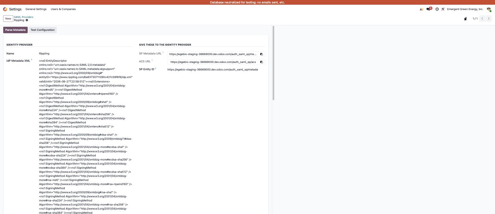
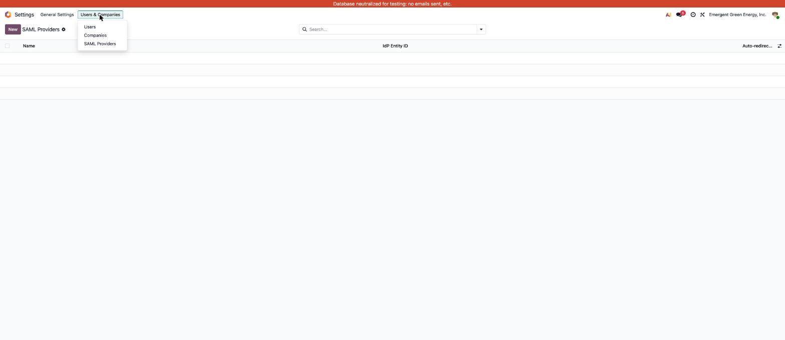

# SAML 2.0 SSO — Single Sign-On for Odoo 19

**Sign in to Odoo through any SAML 2.0 identity provider — Rippling, Okta,
Microsoft Entra ID, Google Workspace and more — with a one-paste setup.**

The first SAML SSO module for Odoo 19, with a first-class Rippling preset.
Proprietary (OPL-1), sold on the Odoo Apps Store. Built and battle-tested by
[EGE Products](https://github.com/KingsKodeDev) on Odoo.sh.

- One-paste setup in both directions: paste the IdP's metadata XML into Odoo,
  paste Odoo's SP metadata URL into the IdP. Copy buttons everywhere.
- SP-initiated *and* IdP-initiated login (works from the Rippling app tile).
- Pure-wheel dependency (`python3-saml`) — no system packages, installs from
  `requirements.txt` on Odoo.sh and anywhere else.
- Strict security defaults, every requirement covered by an executed test.

*Support & purchase: see the Odoo Apps Store listing (coming with the 19.0
release) or contact EGE Products.*

---

Sign in to Odoo through any SAML 2.0 identity provider — Rippling, Okta,
Microsoft Entra ID, Google Workspace and others. Proprietary (OPL-1).

**Passwords are never removed or altered.** SSO adds a way in; it never takes
one away. That single rule is what makes every recovery path below work.

## Install

1. `pip install python3-saml` (or ship this repo's `requirements.txt`; on
   odoo.sh, place it at the branch root). No system packages — the `xmlsec`
   dependency ships prebuilt wheels.
2. Install the `auth_saml_sp` module.

## Screenshots

**The provider form — paste the IdP metadata, everything else is filled for
you; the right column is what you hand back, one copy button each:**



**Where it lives — Settings → Users & Companies → SAML Providers:**



## Setup — two pastes

**In Odoo** (Settings → Users & Companies → SAML Providers):

1. Open the **Rippling** preset (or create a provider for your IdP).
2. Paste the IdP's **metadata XML** into *IdP Metadata* and click **Parse
   Metadata** — it fills the Entity ID, Sign-On URL and certificate. No
   metadata? Fill those three fields by hand; Rippling shows them in its
   SSO setup screen (*Single Sign-on URL*, *Issuer or IdP Entity ID*,
   *X509 Certificate* — the SHA digests are not needed).
3. Click **Test Configuration**, then un-archive the provider.

**In the IdP** (Rippling: the Odoo app's *SSO setup instructions*, Step 2):

4. Paste Odoo's **SP Metadata URL** — shown on the provider form. Done.
   (If your IdP cannot fetch a URL, use the ACS URL and SP Entity ID shown
   beside it.)

Users sign in when their IdP email equals their Odoo login. No per-user
setup; unknown identities are refused, never auto-created.

**Optional:** *Auto-redirect* sends visitors straight to the IdP. Verify
break-glass (below) before enabling it.

## If SSO breaks — the fail-safe ladder

Work down the ladder; each step is independent of the module's health.

**1. Password login, no shell needed:**

```
https://<your-odoo>/web/login?no_sso=1
```

Bypasses auto-redirect. All passwords still work — the module never touches
them.

**2. Disable SSO from the odoo.sh (or server) shell — no Odoo login needed:**

First start the Odoo shell:

```bash
odoo-bin shell --no-http
```

Then, at the `>>>` prompt it opens:

```python
env['saml.provider'].search([]).write({'auto_redirect': False, 'active': False})
env.cr.commit()
```

Login page reverts to stock. Nothing is uninstalled; re-activate when fixed.

**3. Uninstall entirely, same `odoo-bin shell` prompt:**

```python
env['ir.module.module'].search([('name', '=', 'auth_saml_sp')]).button_immediate_uninstall()
env.cr.commit()
```

Every user logs in exactly as they did before the module existed. Provider
configuration is lost (re-paste to reinstate); bindings and replay records
drop with the module.

## Security posture

- Assertions must be **signed**; signatures verify against the configured
  certificate only. Deprecated algorithms (SHA-1) rejected unless explicitly
  allowed per provider.
- Audience, recipient, time window, issuer and `InResponseTo` enforced
  (python3-saml strict mode; ±300 s clock drift tolerance).
- **Replay protection** via an atomic database guard — safe under
  multi-worker deployments.
- One-time login tokens, sha256-stored, 60 s TTL, single use. Session
  creation stays entirely inside Odoo's standard `authenticate()`.
- **MFA layering, per provider:** by default SSO logins skip Odoo's TOTP
  prompt — the IdP already enforced its factors. Password logins always
  honour TOTP, so enabling it on users hardens the fallback path without
  double-prompting SSO users. Turn *IdP handles MFA* off to require Odoo
  TOTP on top of SSO.
- **Logout stays logged out:** with auto-redirect on, logout lands on a
  login page with the redirect suppressed instead of bouncing through the
  live IdP session straight back in.
- Failed sign-ins show the visitor only a reference code; the cause is in
  the server log under that reference.

## Known limits (v1)

- **No SCIM provisioning:** disabling a user in the IdP does **not** disable
  their Odoo user. Deactivate leavers in Odoo until provisioning ships.
- No Single Logout (the IdP's logout URL is stored, unused).
- No just-in-time user creation, by design.
